# System Diagrams — AI-Based Study Planner System
## Mount Kigali University (MKU)

Paste these Mermaid diagrams into https://mermaid.live to generate images for your book.

---

## 1. Context Diagram (Level 0 DFD)

Shows the entire system as ONE box and who interacts with it.

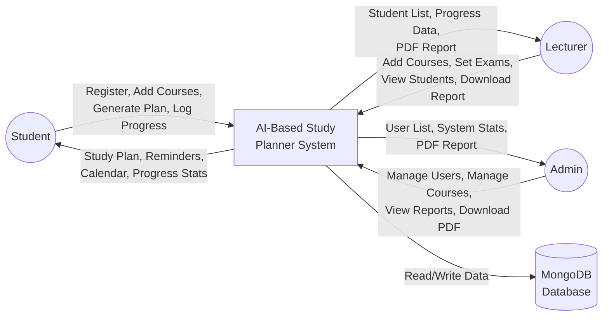

---

## 2. Data Flow Diagram — Level 1 (DFD Level 1)

Shows the main processes inside the system and how data flows between them.

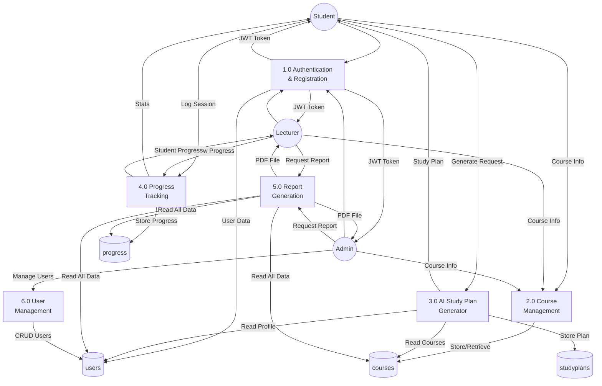

---

## 3. Use Case Diagram — Student Role

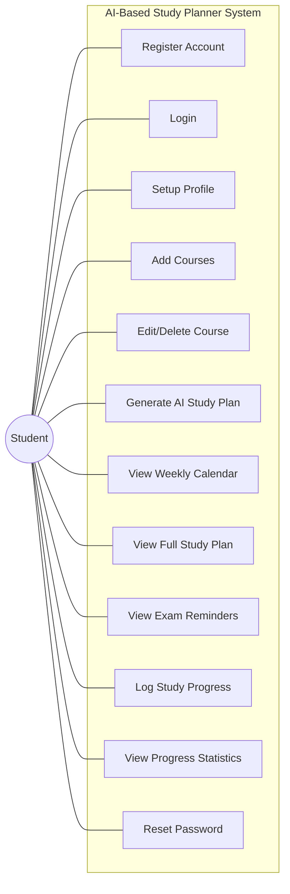

---

## 4. Use Case Diagram — Lecturer Role

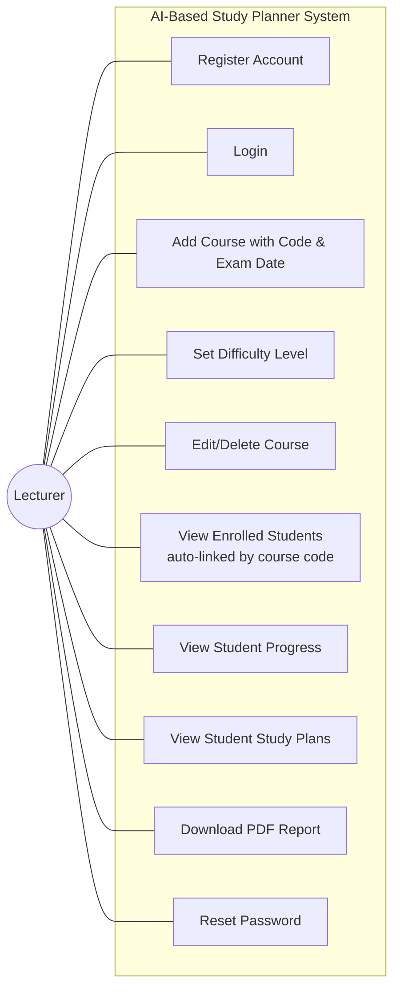

---

## 5. Use Case Diagram — Admin Role

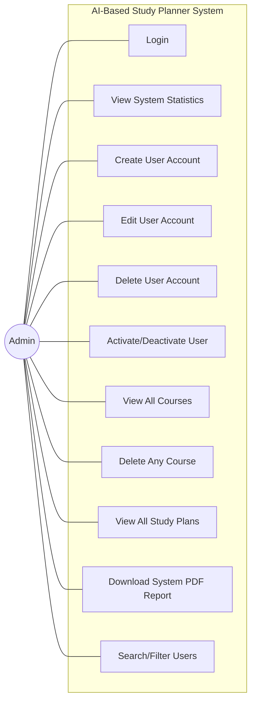

---

## 6. Combined Use Case Diagram — All Roles

```mermaid
graph TB
    subgraph Actors
        S((Student))
        L((Lecturer))
        A((Admin))
    end

    subgraph "Authentication"
        UC_REG[Register]
        UC_LOGIN[Login]
        UC_FORGOT[Reset Password]
    end

    subgraph "Student Features"
        UC_PROFILE[Setup Profile]
        UC_ADD_COURSE[Add Courses]
        UC_GEN_PLAN[Generate AI Study Plan]
        UC_CALENDAR[View Weekly Calendar]
        UC_REMIND[View Exam Reminders]
        UC_PROGRESS[Log & Track Progress]
    end

    subgraph "Lecturer Features"
        UC_L_COURSE[Manage Courses & Exams]
        UC_L_STUDENTS[View Enrolled Students]
        UC_L_PROGRESS[View Student Progress]
        UC_L_PDF[Download PDF Report]
    end

    subgraph "Admin Features"
        UC_A_USERS[Manage All Users]
        UC_A_COURSES[Manage All Courses]
        UC_A_STATS[View System Statistics]
        UC_A_PDF[Download System Report]
    end

    S --- UC_REG
    S --- UC_LOGIN
    S --- UC_FORGOT
    S --- UC_PROFILE
    S --- UC_ADD_COURSE
    S --- UC_GEN_PLAN
    S --- UC_CALENDAR
    S --- UC_REMIND
    S --- UC_PROGRESS

    L --- UC_REG
    L --- UC_LOGIN
    L --- UC_FORGOT
    L --- UC_L_COURSE
    L --- UC_L_STUDENTS
    L --- UC_L_PROGRESS
    L --- UC_L_PDF

    A --- UC_LOGIN
    A --- UC_A_USERS
    A --- UC_A_COURSES
    A --- UC_A_STATS
    A --- UC_A_PDF
```

---

## 7. Activity Diagram — Complete System Flow

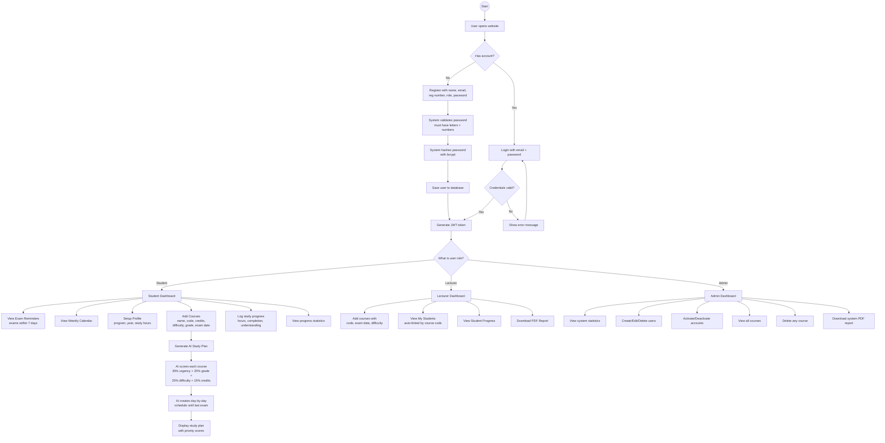

---

## 8. Activity Diagram — AI Study Plan Generation

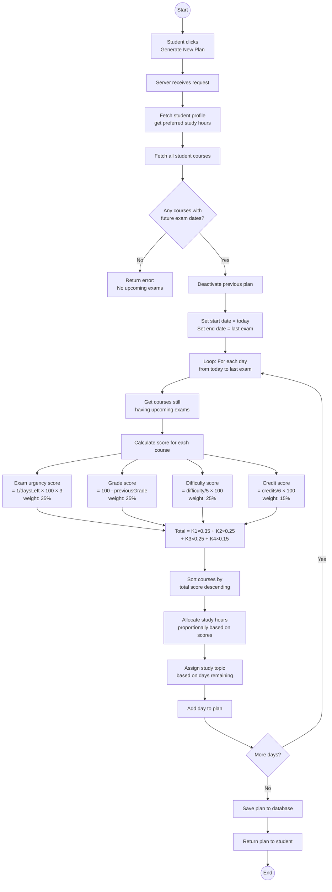

---

## 9. Activity Diagram — Student-Lecturer Linking

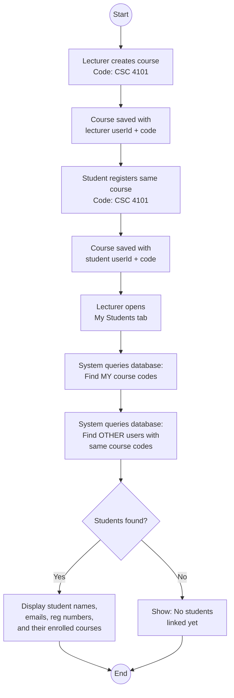

---

## 10. Activity Diagram — Forgot Password

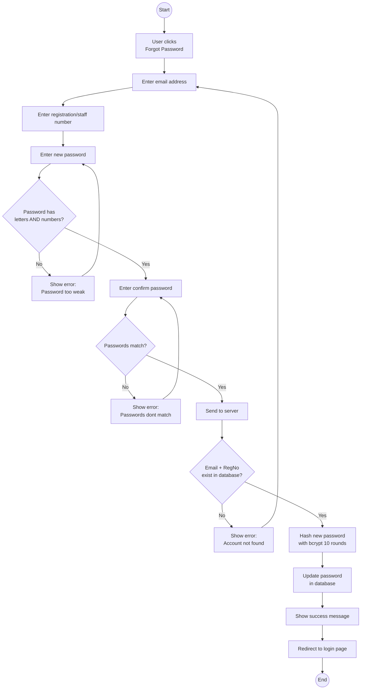

---

## 11. Activity Diagram — Admin User Management

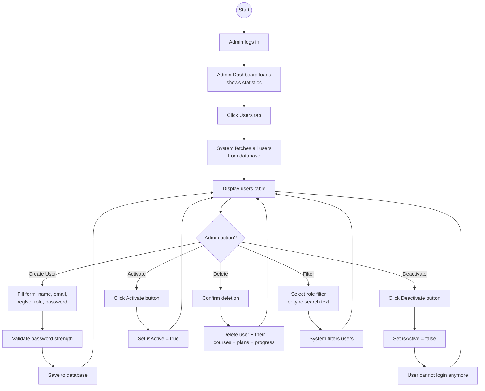

---

## 12. Sequence Diagram — Login Flow

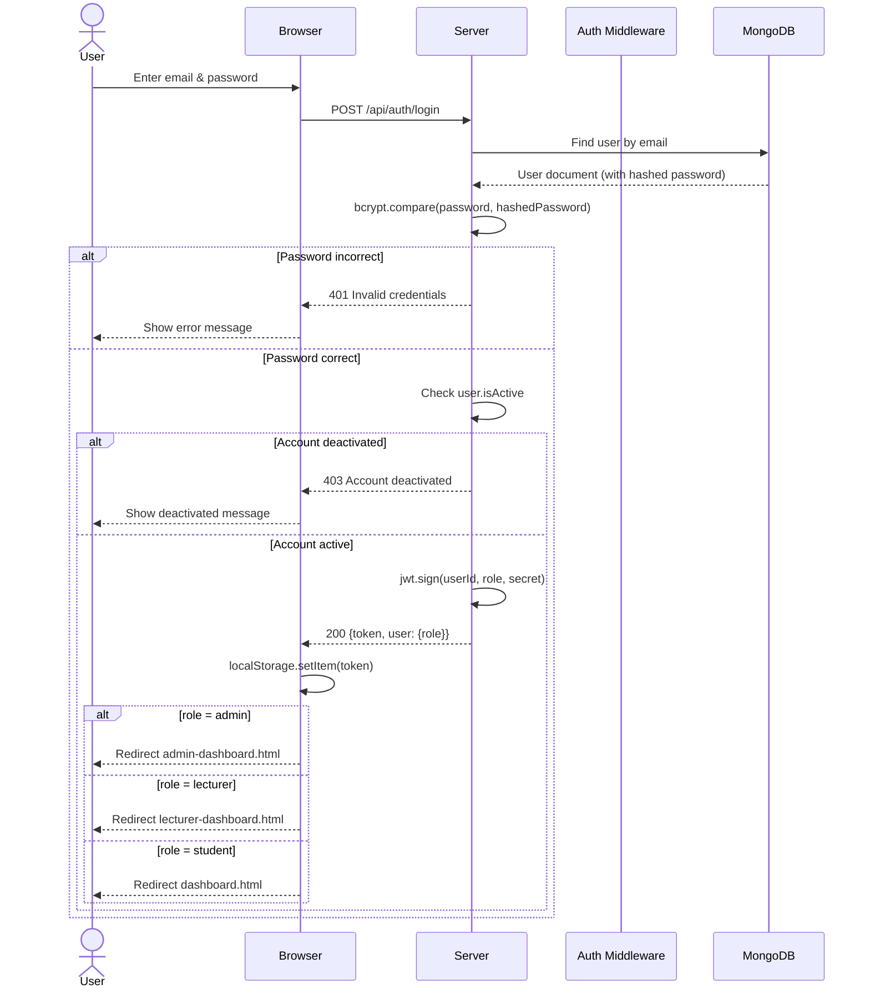

---

## 13. Entity Relationship Diagram (ERD)

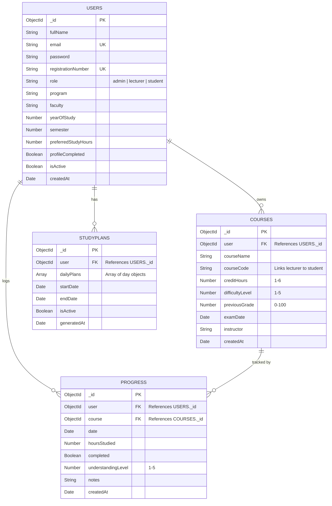

---

## 14. System Architecture Diagram

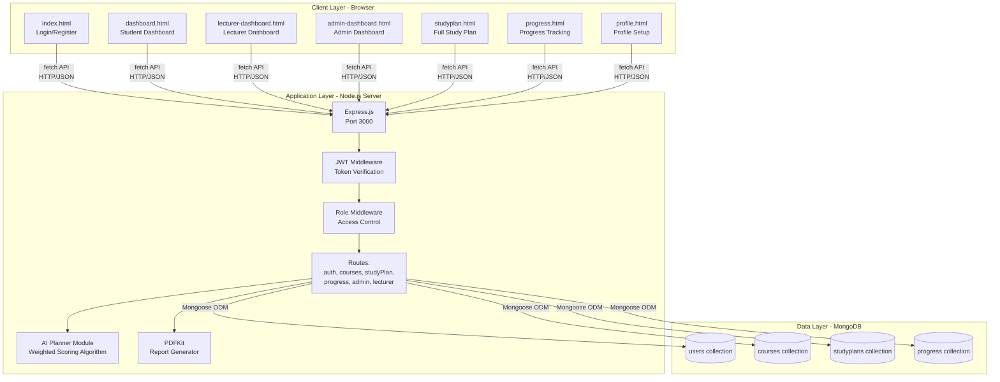

---

## 15. Deployment Diagram

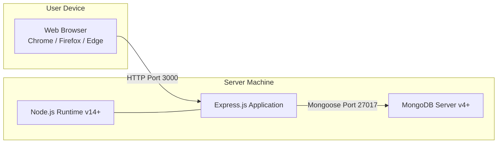

---

## Color Customization Guide

The entire system's colors are controlled from **ONE file**: `public/css/style.css`

All colors are defined as variables at the very top. Change them once and the ENTIRE system updates — navbar, buttons, cards, titles, everything.

### Where to Find (Top of style.css):

```css
:root {
    --primary-blue: #1a56db;       /* Main brand — navbar, buttons, links, titles */
    --primary-dark: #1e3a5f;       /* Dark shade — navbar gradient, headings */
    --primary-light: #3b82f6;      /* Light shade — button hover, active links */
    --secondary-blue: #60a5fa;     /* Secondary — progress bars, accents */
    --accent-blue: #dbeafe;        /* Very light — backgrounds, table headers */
    --white: #ffffff;              /* White — page/card backgrounds */
    --light-gray: #f8fafc;        /* Light gray — body background */
    --gray: #e2e8f0;              /* Gray — borders, dividers */
    --dark-gray: #64748b;         /* Dark gray — secondary text */
    --text-dark: #1e293b;         /* Near black — main text */
    --text-medium: #475569;       /* Medium — descriptions */
    --text-light: #94a3b8;        /* Light — hints, placeholders */
    --success: #10b981;           /* Green — success, completed */
    --warning: #f59e0b;           /* Orange — warnings, reminders */
    --danger: #ef4444;            /* Red — delete, errors, urgent */
}
```

### What Each Variable Controls:

| Variable | What Changes When You Edit It |
|----------|-------------------------------|
| `--primary-blue` | Login button, Generate Plan button, Save buttons, active nav links, stat card numbers, progress bar, all links, calendar highlights |
| `--primary-dark` | Navbar background, page titles (h2), card header text, study plan day headers, login page gradient |
| `--primary-light` | Button hover effect, link hover color, active tab underline |
| `--secondary-blue` | Progress bar gradient end color |
| `--accent-blue` | Table header background, AI scoring boxes, info alert background, badge backgrounds, calendar session items |
| `--white` | Card backgrounds, input field backgrounds, modal backgrounds |
| `--light-gray` | Page body background color |
| `--gray` | Input field borders, table borders, card dividers, tab underlines, progress bar track |
| `--dark-gray` | Secondary button color |
| `--text-dark` | All main text, table data, course names, strong text |
| `--text-medium` | Form labels, descriptions, subtitle text |
| `--text-light` | Placeholder text, hints, empty state text |
| `--success` | Save Course button, Activate button, success alerts, "Completed" badge, green stat cards |
| `--warning` | Exam reminder cards border, "Partial" badge, understanding stars, medium difficulty badges |
| `--danger` | Delete buttons, Deactivate button, Logout button, error alerts, "Urgent" text, high difficulty badge |

### Complete Ready-to-Use Color Themes:

**🔵 Default Blue (Current — Professional University):**
```css
--primary-blue: #1a56db;
--primary-dark: #1e3a5f;
--primary-light: #3b82f6;
--secondary-blue: #60a5fa;
--accent-blue: #dbeafe;
```

**🟢 Green (Nature/Growth):**
```css
--primary-blue: #059669;
--primary-dark: #064e3b;
--primary-light: #10b981;
--secondary-blue: #6ee7b7;
--accent-blue: #d1fae5;
```

**🟣 Purple (Modern/Creative):**
```css
--primary-blue: #7c3aed;
--primary-dark: #4c1d95;
--primary-light: #8b5cf6;
--secondary-blue: #c4b5fd;
--accent-blue: #ede9fe;
```

**🔴 Maroon/Red (Traditional University):**
```css
--primary-blue: #b91c1c;
--primary-dark: #7f1d1d;
--primary-light: #dc2626;
--secondary-blue: #fca5a5;
--accent-blue: #fee2e2;
```

**🟠 Orange (Warm/Energetic):**
```css
--primary-blue: #ea580c;
--primary-dark: #7c2d12;
--primary-light: #f97316;
--secondary-blue: #fdba74;
--accent-blue: #fff7ed;
```

**🫐 Navy (Corporate/Serious):**
```css
--primary-blue: #1e40af;
--primary-dark: #172554;
--primary-light: #2563eb;
--secondary-blue: #93c5fd;
--accent-blue: #dbeafe;
```

**🩷 Pink (Soft/Friendly):**
```css
--primary-blue: #db2777;
--primary-dark: #831843;
--primary-light: #ec4899;
--secondary-blue: #f9a8d4;
--accent-blue: #fce7f3;
```

**🩶 Dark/Charcoal (Sleek/Minimalist):**
```css
--primary-blue: #374151;
--primary-dark: #111827;
--primary-light: #4b5563;
--secondary-blue: #9ca3af;
--accent-blue: #f3f4f6;
```

### How to Change (3 Steps):
1. Open `public/css/style.css`
2. Replace the 5 color values under `:root {` with any theme above
3. Save and refresh browser (Ctrl + Shift + R)

### Change Individual Parts Only:

**Navbar only:**
```css
.header {
    background: linear-gradient(135deg, var(--primary-dark), var(--primary-blue));
}
```

**Login page background only:**
```css
.auth-container {
    background: linear-gradient(135deg, var(--primary-dark) 0%, var(--primary-blue) 100%);
}
```

**All primary buttons only:**
```css
.btn-primary {
    background-color: var(--primary-blue);
}
.btn-primary:hover {
    background-color: var(--primary-dark);
}
```

**Study plan day headers only:**
```css
.plan-day-header {
    background: linear-gradient(135deg, var(--primary-dark), var(--primary-blue));
}
```

**Stat card top border only:**
```css
.stat-card {
    border-top: 4px solid var(--primary-blue);
}
```

**Logout button only:**
```css
.nav-links .btn-logout {
    background-color: rgba(239, 68, 68, 0.8);
}
```

---

## How to Generate Images from These Diagrams

1. Go to **https://mermaid.live**
2. Delete the example code on the left side
3. Paste ONE diagram code block (without the ``` marks)
4. The image appears on the right side
5. Click the download button (PNG or SVG)
6. Insert the image into your Word document or PowerPoint

**Alternative:** Install "Mermaid Preview" extension in VS Code — diagrams render right inside the editor.
